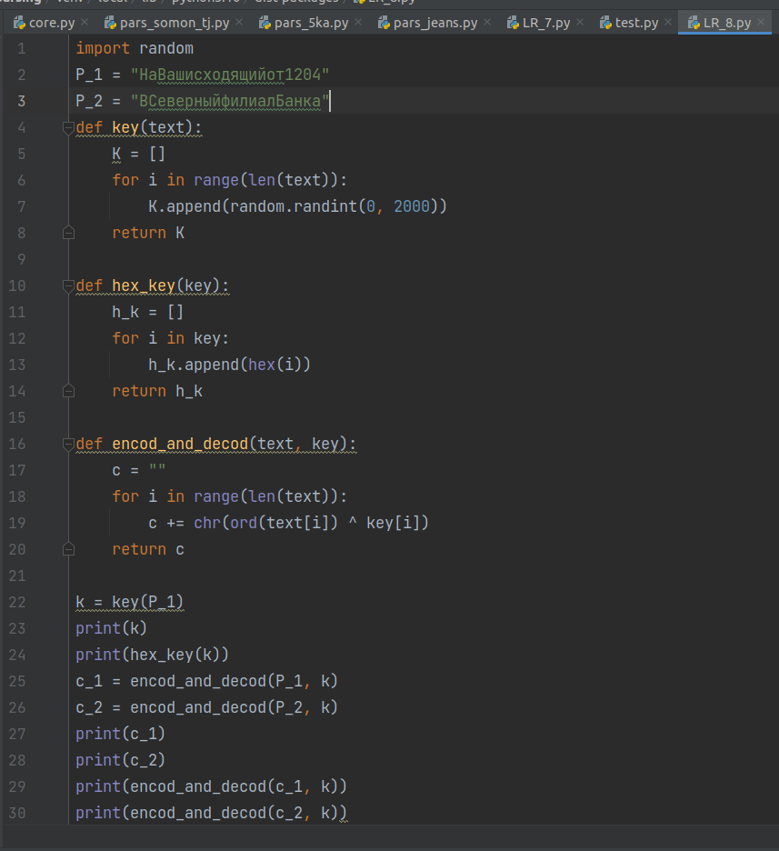
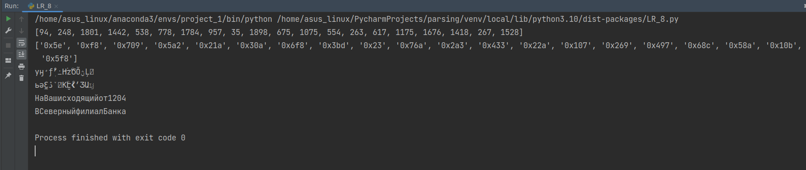

---
## Front matter
lang: ru-RU
title: Лабораторная работа №8
author: |
	 Аминов Зулфикор\inst{1}

institute: |
	\inst{1}Российский Университет Дружбы Народов

date: 29.10, 2022, Москва, Россия

## Formatting
mainfont: PT Serif
romanfont: PT Serif
sansfont: PT Sans
monofont: PT Mono
toc: false
slide_level: 2
theme: metropolis
header-includes: 
 - \metroset{progressbar=frametitle,sectionpage=progressbar,numbering=fraction}
 - '\makeatletter'
 - '\beamer@ignorenonframefalse'
 - '\makeatother'
aspectratio: 43
section-titles: true

---

# Цели и задачи работы

## Цель лабораторной работы

Освоить на практике применение режима однократного гаммирования
на примере кодирования различных исходных текстов одним ключом.

# Задание к лабораторной работе

## Задание

Два текста кодируются одним ключом (однократное гаммирование).
Требуется не зная ключа и не стремясь его определить, прочитать оба тек-
ста. Необходимо разработать приложение, позволяющее шифровать и де-
шифровать тексты P1 и P2 в режиме однократного гаммирования. Прило-
жение должно определить вид шифротекстов C1 и C2 обоих текстов P1 и
P2 при известном ключе ; Необходимо определить и выразить аналитиче-
ски способ, при котором злоумышленник может прочитать оба текста, не
зная ключа и не стремясь его определить.

# Выполнение работы

## Программа на python

{ #fig:1 width=100% height=100% }

## Результат работы

{ #fig:2 width=100% height=100% }

# Выводы по проделанной работе

## Вывод

Освоили на практике применение режима однократного гаммирования
на примере кодирования различных исходных текстов одним ключом.
