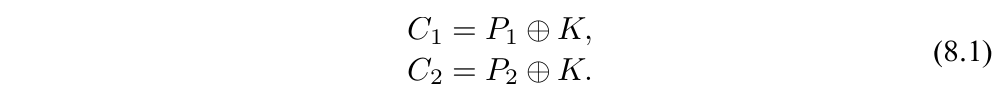
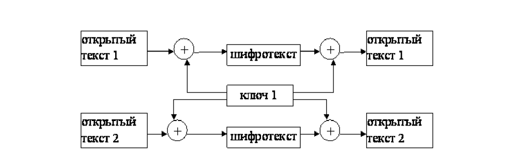
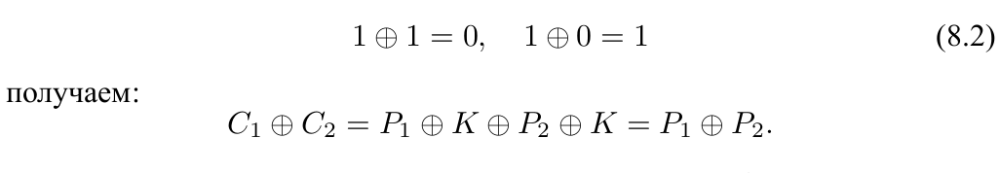
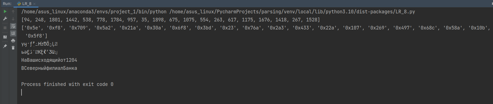

---
# Front matter
title: "Отчёт по лабораторной работе №8"
subtitle: "Элементы криптографии. Шифрование (кодирование) различных исходных текстов одним ключом"
author: "Аминов Зулфикор Мирзокаримович"

# Generic otions
lang: ru-RU
toc-title: "Содержание"

# Bibliography
bibliography: bib/cite.bib
csl: pandoc/csl/gost-r-7-0-5-2008-numeric.csl

# Pdf output format
toc: true # Table of contents
toc_depth: 2
fontsize: 12pt
linestretch: 1.5
papersize: a4
documentclass: scrreprt
## I18n
polyglossia-lang:
  name: russian
  options:
	- spelling=modern
	- babelshorthands=true
polyglossia-otherlangs:
  name: english
### Fonts
mainfont: PT Serif
romanfont: PT Serif
sansfont: PT Sans
monofont: PT Mono
mainfontoptions: Ligatures=TeX
romanfontoptions: Ligatures=TeX
sansfontoptions: Ligatures=TeX,Scale=MatchLowercase
monofontoptions: Scale=MatchLowercase,Scale=0.9
## Biblatex
biblatex: true
biblio-style: "gost-numeric"
biblatexoptions:
  - parentracker=true
  - backend=biber
  - hyperref=auto
  - language=auto
  - autolang=other*
  - citestyle=gost-numeric
## Misc options
indent: true
header-includes:
  - \linepenalty=10 # the penalty added to the badness of each line within a paragraph (no associated penalty node) Increasing the value makes tex try to have fewer lines in the paragraph.
  - \interlinepenalty=0 # value of the penalty (node) added after each line of a paragraph.
  - \hyphenpenalty=50 # the penalty for line breaking at an automatically inserted hyphen
  - \exhyphenpenalty=50 # the penalty for line breaking at an explicit hyphen
  - \binoppenalty=700 # the penalty for breaking a line at a binary operator
  - \relpenalty=500 # the penalty for breaking a line at a relation
  - \clubpenalty=150 # extra penalty for breaking after first line of a paragraph
  - \widowpenalty=150 # extra penalty for breaking before last line of a paragraph
  - \displaywidowpenalty=50 # extra penalty for breaking before last line before a display math
  - \brokenpenalty=100 # extra penalty for page breaking after a hyphenated line
  - \predisplaypenalty=10000 # penalty for breaking before a display
  - \postdisplaypenalty=0 # penalty for breaking after a display
  - \floatingpenalty = 20000 # penalty for splitting an insertion (can only be split footnote in standard LaTeX)
  - \raggedbottom # or \flushbottom
  - \usepackage{float} # keep figures where there are in the text
  - \floatplacement{figure}{H} # keep figures where there are in the text
---

# Цель работы

Освоить на практике применение режима однократного гаммирования
на примере кодирования различных исходных текстов одним ключом.

# Указание к работе

Исходные данные.

Две телеграммы Центра:

P1 = НаВашисходящийот1204

P2 = ВСеверныйфилиалБанка

Ключ Центра длиной 20 байт:

K = 05 0C 17 7F 0E 4E 37 D2 94 10 09 2E 22 57 FF C8 OB B2 70 54

Режим шифрования однократного гаммирования одним ключом двух
видов открытого текста реализуется в соответствии со схемой, приведён-
ной на рис. 8.1.

Шифротексты обеих телеграмм можно получить по формулам режима
однократного гаммирования:

{ #fig:8 width=100% height=100% }

Открытый текст можно найти в соответствии с (8.1), зная шифротекст
двух телеграмм, зашифрованных одним ключом. Для это оба равенства (8.1)

{ #fig:8.1 width=100% height=100% }

складываются по модулю 2. Тогда с учётом свойства операции XOR

{ #fig:8.2 width=100% height=100% }

Предположим, что одна из телеграмм является шаблоном — т.е. име-
ет текст фиксированный формат, в который вписываются значения полей.
Допустим, что злоумышленнику этот формат известен. Тогда он получает
достаточно много пар C1 ⊕ C2 (известен вид обеих шифровок). Тогда зная
P1 и учитывая (8.2), имеем:

{ #fig:8.3 width=100% height=100% }

Таким образом, злоумышленник получает возможность определить те
символы сообщения P2 , которые находятся на позициях известного шаб-
лона сообщения P1 . В соответствии с логикой сообщения P2 , злоумышлен-
ник имеет реальный шанс узнать ещё некоторое количество символов сооб-
щения P2 . Затем вновь используется (8.3) с подстановкой вместо P1 полу-
ченных на предыдущем шаге новых символов сообщения P2 . И так далее.
Действуя подобным образом, злоумышленник даже если не прочитает оба
сообщения, то значительно уменьшит пространство их поиска.

# Выполнение работы

## Программа на python

```
import random

P_1 = "НаВашисходящийот1204"
P_2 = "ВСеверныйфилиалБанка"

def key(text):
    K = []
    for i in range(len(text)):
        K.append(random.randint(0, 2000))
    return K

def hex_key(key):
    h_k = []
    for i in key:
        h_k.append(hex(i))
    return h_k

def encod_and_decod(text, key):
    c = ""
    for i in range(len(text)):
        c += chr(ord(text[i]) ^ key[i])
    return c

k = key(P_1)
print(k)
print(hex_key(k))
c_1 = encod_and_decod(P_1, k)
c_2 = encod_and_decod(P_2, k)
print(c_1)
print(c_2)
print(encod_and_decod(c_1, k))
print(encod_and_decod(c_2, k))
```

## Результат работы

{ #fig:9 width=100% height=100% }

# Выводы

Освоили на практике применение режима однократного гаммирования
на примере кодирования различных исходных текстов одним ключом.
